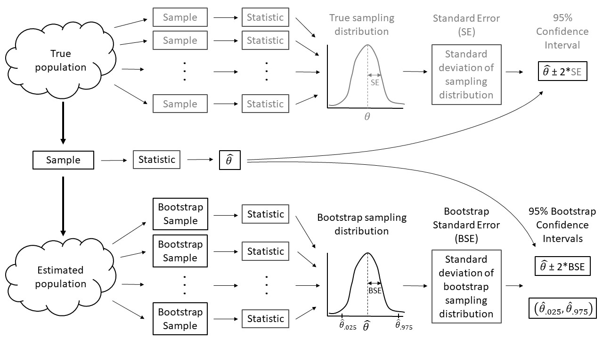

## This is not my work all the credit goes to the authers of the paper, i have just created a github repository for my convinience.

# Bootstrapping4Biologists

This repository contains all files (code, data, manuscript text written using RMarkdown) needed to re-create the following manuscript:

Fieberg, J. D. H. Johnson, and K. Vitense. Resampling-based methods for biologists
 
## Abstract

Ecological data often violate common assumptions of traditional parametric  statistics (e.g., that residuals are Normally distributed, have constant variance, and cases are independent). Modern statistical methods   are well equipped to handle these complications, but they can be challenging for   non-statisticians to understand and implement. Rather than default to increasingly complex statistical methods, resampling-based methods can sometimes provide an alternative method for performing statistical inference, while also facilitating a deeper  understanding of foundational concepts in frequentist statistics (e.g., sampling distributions, confidence intervals, *p*-values). Using simple examples and case studies, we demonstrate how resampling-based methods can help elucidate core statistical   concepts and provide alternative methods for tackling challenging problems   across a broad range of ecological applications.

## Bootstrap Schematic

A sampling distribution is the distribution of sample statistics computed using different samples of the same size from the same population. We can estimate characteristics of the sampling distribution (e.g., its standard deviation) using bootstrapping, in which we repeatedly sample from an estimated population.  Each bootstrap sample should be the same size as the original sample, and bootstrap samples should be formed in such a way that they preserve the structure of the original data set (e.g., any clustering or other forms of correlation).
